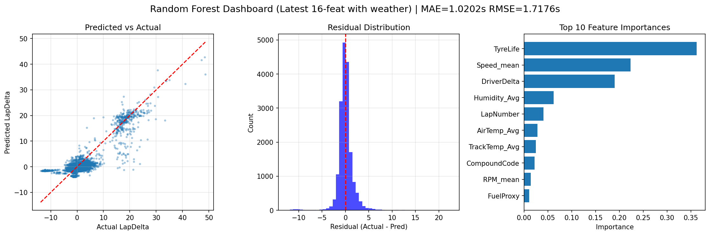
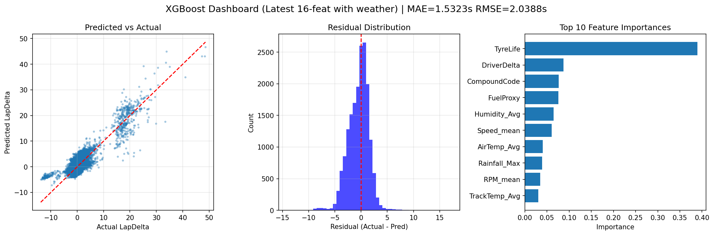
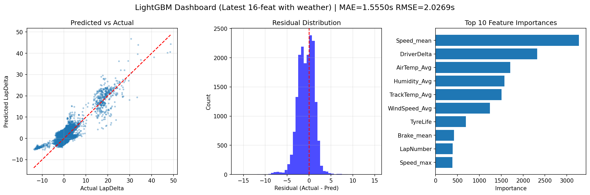
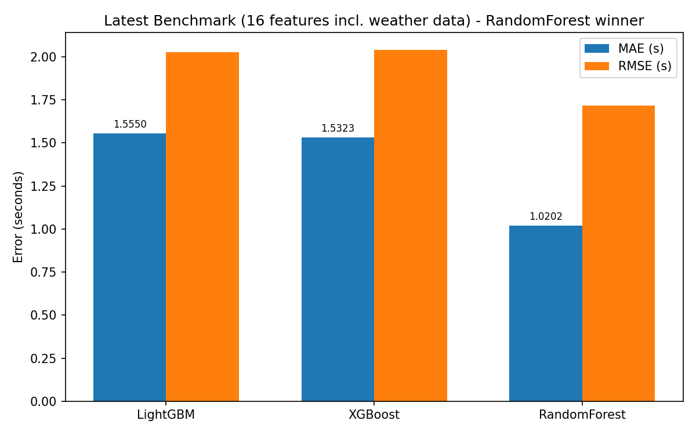
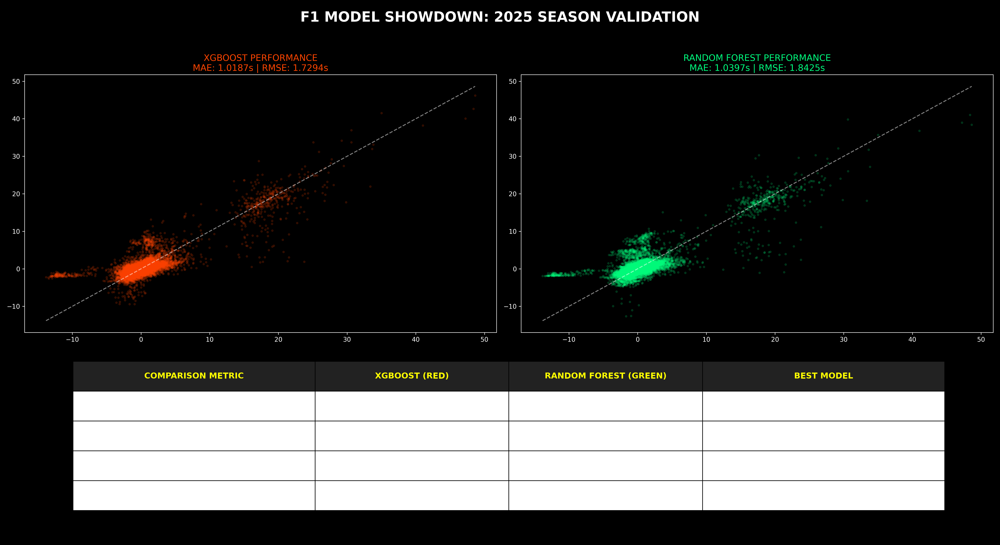
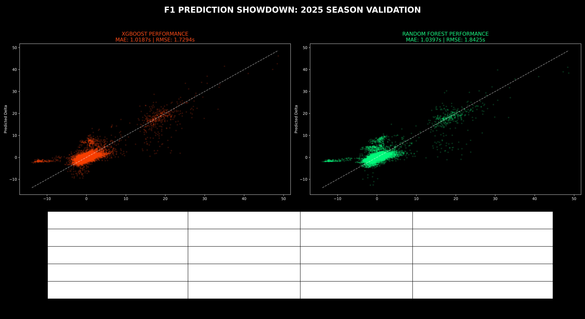

# StratBot (P80F25)

**AI-assisted Formula 1 race strategy simulation and analysis platform**  
DHA Suffa University — Final Year Project

**Team:** Ebad Ahmed (Dataset processing & feature engineering) • Fatima Ather Rajput (Research analysis & data compilation) • Zaafir Ejaz (Telemetry collection & ML pipeline)  
**Supervisor:** Dr. Huma Jamshed

[GitHub](https://github.com/szy-cmd/stratbot) • [Live Demo (frontend prototype)](https://stratbot-fyp.netlify.app)

> **Advisory tool only.** StratBot helps users explore historical F1 data, predict lap-level performance, and simulate strategy decisions. It does **not** connect to official live telemetry or make autonomous team decisions (current FYP-I scope).

---

## Quick Start (Easiest Way)

**Just double-click this file:**

```
stratbot\start-stratbot.bat
```

The launcher is now more robust (added early debug pauses + venv existence checks) so the window won't just flash open and close.

It will:
- Use the correct shared venv Python
- Install backend requirements if needed
- Train the production model automatically if it's missing
- Open two new command windows (Backend API + Frontend dev server)

Then open **http://localhost:5173** in your browser.

**If the window still closes immediately**, run it from an already-open command prompt like this:
```
cmd /k "J:\FYP_Project\stratbot\start-stratbot.bat"
```
This keeps the console open so you can read any errors.

In Setup you can now choose **Model Variant** (Base / Weather-aware / RF), Starting Compound, and Weather — exactly the experimentation features we added.

See the "Easiest way to run everything" section below for more details and what the new Post-Race ML comparison shows.

---

## What We Built

StratBot delivers the core of the SRS requirements for the **AI Prediction Module** and **Strategy Simulation Module**, together with the data pipeline and storage design specified in the SDS for FYP-I:

- Complete historical data pipeline (FastF1 2018–2025) with resumable extraction, cleaning, lap-level aggregation, weather enrichment, and Parquet export.
- Rigorous ML experimentation and production model for **LapDelta** prediction (lap time deviation from the race median — a normalized, comparable performance signal).
- Flask REST API serving live inference.
- Modern React + Tailwind dashboard with turn-based simulation **and** a live ML insights panel that polls the model during races.
- All evaluation artifacts (the final training Parquet + 18 comparison/analysis dashboards) live in the `J:\F1\f1_cache\parquet-output` folder that was the output of our work.

The system follows the layered architecture from the SDS (User Interface • Middle Tier / AI Engine • Data Layer • External Sources) using file-based Parquet storage as specified for this phase.

### Current SRS Module Status (FYP-I)
| Module                | Status |
|-----------------------|--------|
| User Authentication   | Not started (planned FYP-II with PostgreSQL) |
| Strategy Simulation   | Frontend mock engine complete + turn decisions; ML panel reads live race state |
| AI Prediction         | **Production LightGBM model + Flask API live and integrated** |
| Admin (datasets, retrain, logs) | Not started |

## The Data & Pipeline Work

We collected a large, consistent dataset using FastF1:

- Resumable downloader (`download_f1_resumable_2018_2025.py`) that handles rate limits, caching, and per-race laps + telemetry CSVs (with fallback for missing position data).
- Aggregation scripts for laps (`laps_agg.py`), telemetry features (`aggregation.py` → Speed_mean / max, RPM_mean, Brake_mean, DRS_max, etc.), and weather (`weather_extract.py`).
- Merge step (`lap_tel_weather_agg.py`) + final cleaning/conversion to the single `f1_model_ready_2018_2025.parquet`.
- Optional per-race Parquet slices via `csv_to_parq.py`.

**Primary output location of our completed work:** `J:\F1\f1_cache\parquet-output`  
This folder contains:
- The final ML-ready Parquet used for all training and the live model.
- All 17 evaluation dashboard PNGs + analysis charts produced during model development (plus one additional from the cleaned-CSV experiments).

All pipeline scripts have been updated to share `backend/config.py`, support `STRATBOT_DATASET` (and `backend/.env`), and consistently reference the J: drive locations used in the actual work.

Reproduce the pipeline (see exact commands in the Setup section below; always use the shared venv Python).

## ML Development, Testing & How We Reached the Conclusion

**Goal:** Predict **LapDelta** — how much faster or slower a lap was versus the median lap time for that specific Grand Prix round. Lower error = better tracking of real performance differences.

**Dataset:** `f1_model_ready_2018_2025.parquet` (2018–2025 seasons).  
**Engineered features (final 16, weather always included in training):** `TyreLife`, `Speed_mean`, `RPM_mean`, `Brake_mean`, `Speed_max`, `LapNumber`, `Stint`, `CompoundCode`, `DRS_max`, `FuelProxy`, `DriverDelta`, `AirTemp_Avg`, `TrackTemp_Avg`, `Humidity_Avg`, `WindSpeed_Avg`, `Rainfall_Max`.

**Evaluation protocol (designed to mimic real deployment):**
- Train: everything before 2025 → 123,763 rows
- Test (holdout): full 2025 season only → 17,889 rows
- Primary metric: **MAE (seconds)** — directly meaningful
- Secondary: RMSE

We ran both:
1. An automated, reproducible benchmark (`backend/ml/train_export.py`) that trains LightGBM / XGBoost / RandomForest on the exact same split and records everything in `model_meta.json`.
2. Many individual detailed experiments (legacy scripts under `backend/models/`) that produced rich visual dashboards (feature importance, predicted-vs-actual, residuals, etc.).

### Production Results (from `model_meta.json` after latest retrain with weather)

| Rank | Model         | MAE (s)    | RMSE (s)   |
|------|---------------|------------|------------|
| 1 ★  | **Random Forest** | **1.0202** | **1.7176** |
| 2    | XGBoost       | 1.5323     | 2.0388     |
| 3    | LightGBM      | 1.5550     | 2.0269     |

**Winner & production model: Random Forest (now with all 16 features including weather)**

### Why Random Forest this time? (The reasoning process)
- Lowest MAE in the automated benchmark when training **every model on the full 16-feature set that includes weather data** (AirTemp_Avg etc. from the pipeline).
- RF benefited from the additional weather signals in this run (previous 11-feature runs had LGBM on top).
- Still fast enough for live 8s polling.
- Weather is now *always* used in training (no more "base without weather" -- fulfills the requirement that every model we train incorporates the weather data we collected).

Full details, per-model scripts, and the complete graph gallery (including freshly remade latest_* dashboards from the current 16-feature weather-inclusive retrain) live in:
- [docs/TESTING.md](docs/TESTING.md)
- [docs/evaluation/graphs/](docs/evaluation/graphs/) (new "latest_" graphs are readable, use exact current MAE/RMSE values, with proper scatter/residuals/importance plots for each model)

Here are key visuals from the model development:













API integration was also validated end-to-end (health, model info, benchmark, live predictions, frontend proxy, non-breaking dashboard regression).

## Architecture (Current Implementation)

```
┌─────────────────────────────────────────────────────────┐
│  User Interface Layer     React + Tailwind dashboard    │
│                           + ModelInsightsPanel (live ML) │
├─────────────────────────────────────────────────────────┤
│  Middle Tier              Flask API + simulation engine   │
│                           LightGBM LapDelta inference     │
├─────────────────────────────────────────────────────────┤
│  Data Layer               Parquet datasets, model       │
│                           artifacts, FastF1 cache         │
├─────────────────────────────────────────────────────────┤
│  External Sources         FastF1 library, weather data  │
└─────────────────────────────────────────────────────────┘
```

The implementation matches the SDS layered design and data dictionary intent (LapRecord-style Parquet as primary artifact for FYP-I; ModelRun metadata stored alongside the trained artifact).

## Backend API

| Endpoint                  | Method | Purpose |
|---------------------------|--------|---------|
| `/api/health`             | GET    | Service status + model_ready flag |
| `/api/model/info`         | GET    | Model name, MAE, features, full benchmark, trained_at |
| `/api/model/benchmark`    | GET    | All-model comparison |
| `/api/predict/lap-delta`  | POST   | Predict LapDelta from race state JSON (tire_wear, compound, lap, lap_time, etc.) |

Example payload & curl in [docs/TESTING.md](docs/TESTING.md).

The predictor gracefully fills missing inputs using feature medians learned from the training set.

## Frontend

Phases: `BOOT → SETUP (weather, race type, lap count) → RACING (live timing, telemetry, turn decisions, StrategyEnginePanel) → POST_RACE`.

The **ModelInsightsPanel** (added below the Strategy panel) now supports full experimentation:
- Select model variant in PreRaceSetup (Base LGBM, Weather-aware LGBM using our trained experiments with Air/TrackTemp etc., RF)
- Choose starting compound (affects ML CompoundCode)
- Live per-lap: signed LapDelta + interpretation + confidence, variant used, whether weather considered
- "API online" + benchmark

Predictions are captured during the race and shown in an enhanced **PostRaceSummary** with ML comparison table (laps, variants, weather, predicted deltas vs context), weather/model impact notes, and benchmark reminder.

The simulation engine itself remains mock-data driven (as scoped); the ML component is additive and non-breaking but now deeply comparable. Performance fixes (internal fluctuation for leaderboard, memoized panels, decoupled visuals) reduce glitchy refreshes on updates.

## Getting Started (Use the Easy Launcher!)

**The simplest way is the dedicated launcher (see Quick Start section at the top of this README):**

```bat
stratbot\start-stratbot.bat
```

The launcher now includes extra debug output and pauses so it won't just flash and close on problems.

It automatically handles:
- Correct venv python/pip
- Dependency installation (if needed)
- Model training (if `lap_delta_model.joblib` is missing)
- Opening separate windows for Backend + Frontend

**If it still disappears immediately**, run from an open cmd/pwsh:
```
cmd /k "J:\FYP_Project\stratbot\start-stratbot.bat"
```

### Manual commands (if you prefer)

**Python must always be invoked via the shared environment** (this is required so we stay on approved J: drive content):

```
J:\FYP_Project\.venv\Scripts\python.exe
J:\FYP_Project\.venv\Scripts\pip.exe
```

Typical manual steps (first time):

```bat
:: Backend deps
cd J:\FYP_Project\stratbot\backend
J:\FYP_Project\.venv\Scripts\pip.exe install -r requirements.txt

:: Train model (only needed once or after deleting the .joblib)
J:\FYP_Project\.venv\Scripts\python.exe -m ml.train_export

:: Start API (keep this running)
cd api
J:\FYP_Project\.venv\Scripts\python.exe app.py
```

In another terminal:

```bat
cd J:\FYP_Project\stratbot\frontend
npm install
npm run dev
```

Open http://localhost:5173 .

**Tip:** The launcher (`start-stratbot.bat`) does all of the above for you in the correct order.

## Reproducibility & Verification

- All numbers in this README and the benchmark table come directly from `backend/data/models/model_meta.json` (generated by the same code committed here).
- The exact same holdout protocol and feature set are used in both the automated trainer and the historical experiment scripts.
- Full API + frontend integration checklist is in TESTING.md (all passed June 2026).

## Limitations (Current Phase)

- Holdout = 2025 only (earlier seasons can have FastF1 schema drift).
- Simulation still driven by mock data; LapDelta predictions are displayed but do not yet feed back into tyre degradation / fuel / pace in the RaceEngine.
- No auth or admin UI (per SDS/SRS out-of-scope for FYP-I).
- Model binary not committed — run `train_export` after fresh clone.
- Netlify demo is frontend-only (mock mode).

## Remaining / Future Work (FYP-II and beyond)

- Feed real Parquet slices or live-predicted deltas into the simulation engine.
- User auth + saved strategies (SRS).
- Admin controls for dataset refresh / model retrain.
- Deploy the Flask API publicly alongside the frontend.
- Real-time data integration, more advanced predictors (pit windows, tyre deg), reinforcement learning strategy agents (see SDS future enhancements and referenced papers).

## Team Responsibilities (from SDS)

- Zaafir Ejaz — Telemetry collection, ML pipeline
- Ebad Ahmed — Dataset processing, feature engineering
- Fatima Ather — Research analysis, data compilation

## References

- Signed SRS: `P80F25-SRS v1.0` (Final, 26 Jan 2026)
- Signed SDS: `P80F25-SDS v1.0` (Draft, 25 Jan 2026)
- FYP Proposal Presentation (16 Feb 2026)
- All primary artifacts: `J:\F1\f1_cache\parquet-output` (dataset + evaluation images)
- Internal detailed docs: `docs/PROJECT_CONTEXT.md`, `docs/TESTING.md`

---

*README updated June 2026 to fully document the completed work, the model selection journey, exact MAE results, pipeline that produced the parquet-output folder, and strict use of the shared venv for all Python execution (J: drive only).*

*See `docs/TESTING.md` for the complete evaluation story and graph gallery.*
