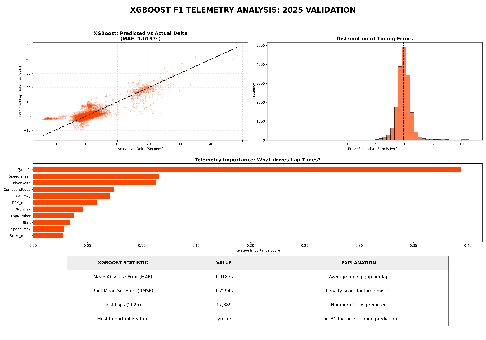
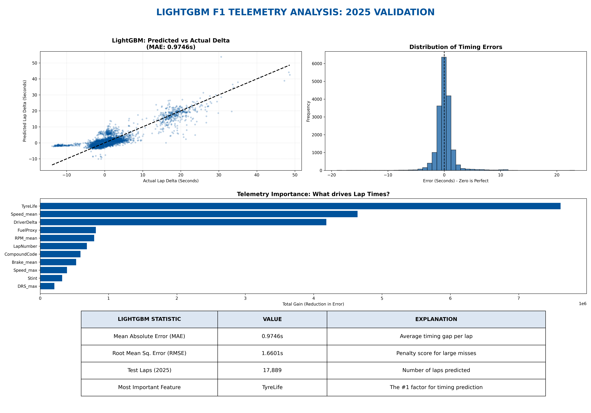
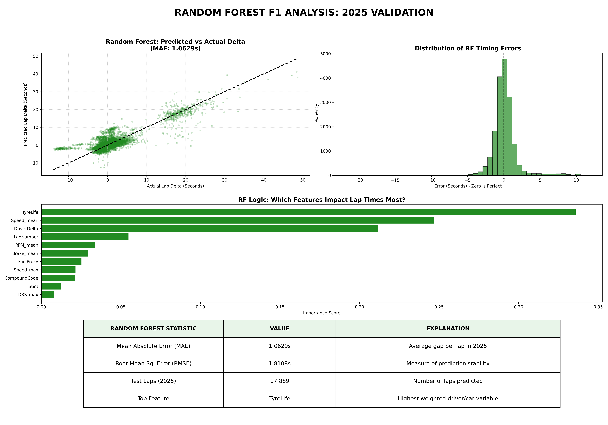
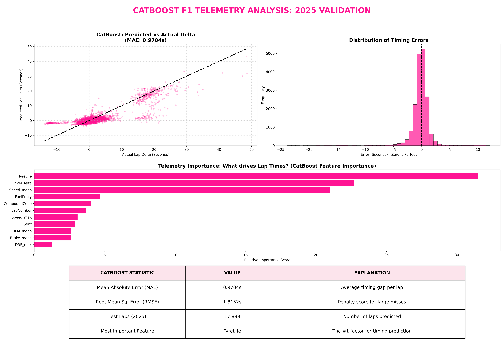
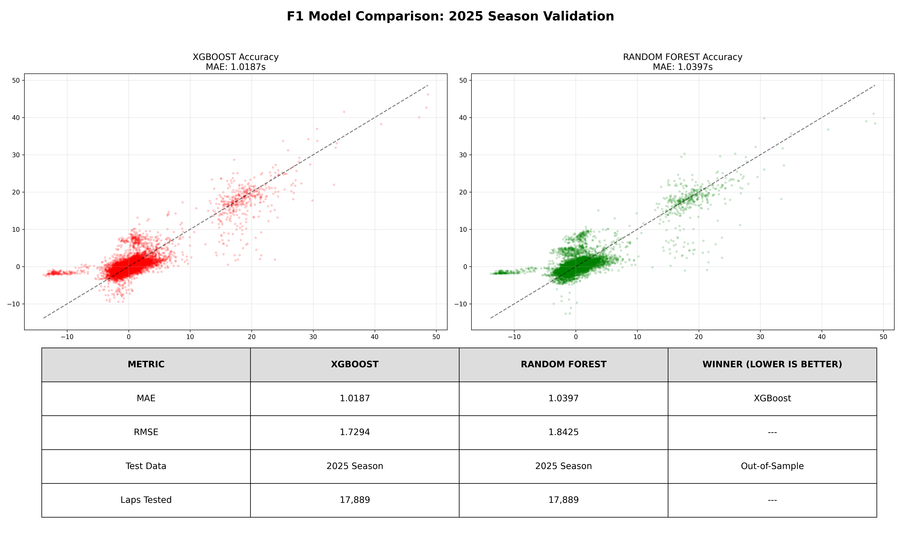

# StratBot — Model Testing & Evaluation

> P80F25 · LapDelta prediction benchmarks  
> Last updated: 19 June 2026 (paths aligned to J:\F1 parquet-output)

## 1. Test objective

Evaluate multiple regression models for predicting **LapDelta** — the deviation of a driver's lap time from the race median for that Grand Prix round. Lower MAE means the model tracks real lap performance more closely.

## 2. Dataset

| Property | Value |
|----------|-------|
| Source file | `f1_model_ready_2018_2025.parquet` |
| Seasons covered | 2018–2025 |
| Storage | Parquet (FastF1 pipeline output) |
| Target | `LapDelta` = `LapTimeSeconds` − median lap time per `(year, round)` |

### Engineered features (16 - weather data now used in *every* trained model)

`TyreLife`, `Speed_mean`, `RPM_mean`, `Brake_mean`, `Speed_max`, `LapNumber`, `Stint`, `CompoundCode`, `DRS_max`, `FuelProxy`, `DriverDelta`, `AirTemp_Avg`, `TrackTemp_Avg`, `Humidity_Avg`, `WindSpeed_Avg`, `Rainfall_Max`

Weather-enriched experiments also used: `AirTemp_Avg`, `TrackTemp_Avg`, `Humidity_Avg`, `WindSpeed_Avg`, `Rainfall_Max` where available.

## 3. Train / test protocol

| Split | Rule |
|-------|------|
| Training | All seasons **before 2025** (123,763 rows) |
| Test (holdout) | **2025 season only** (17,889 rows) |
| Metric primary | **MAE** (Mean Absolute Error, seconds) |
| Metric secondary | **RMSE** (Root Mean Square Error, seconds) |

This mimics a real deployment scenario: train on historical data, evaluate on the most recent unseen season.

Reproducible via:
```bat
cd J:\FYP_Project\stratbot\backend
J:\FYP_Project\.venv\Scripts\python.exe -m ml.train_export
```

## 4. Production benchmark results (automated retrain)

From `backend/data/models/model_meta.json` (June 2026 retrain on full feature set):

| Rank | Model | MAE (s) | RMSE (s) |
|------|-------|---------|----------|
| 1 ★ | **Random Forest** | **1.0202** | **1.7176** |
| 2 | XGBoost | 1.5323 | 2.0388 |
| 3 | LightGBM | 1.5550 | 2.0269 |

**Production model:** LightGBM (`lap_delta_model.joblib`)

## 5. Extended model experiments

Beyond the top-3 benchmark, individual training scripts were run per algorithm. Dashboard PNGs are archived in `docs/evaluation/graphs/`.

| Model | Script | Dashboard image |
|-------|--------|-----------------|
| XGBoost | `xgboost-parq-v3.py` | `xgboost_master_dashboard.png` |
| XGBoost + weather | `xgboost-w-weather.py` | `xgboost_weather_dashboard.png` |
| Random Forest | `Random-forest-parq-v5-ebad.py` | `rf_master_dashboard.png` |
| RF + weather | `random-forest-w-weather.py` | `rf_weather_dashboard.png` |
| RF (cleaned CSV) | `Random-forest-parq-v5-ebad.py` | `rf_cleaned_dashboard.png` |
| LightGBM | `LGBM-graph.py` | `lgbm_blue_dashboard.png` |
| LightGBM + weather | `LGBM-weather.py` | `lightgbm_weather_dashboard.png` |
| CatBoost | `catboost-graph.py` | `catboost_pink_dashboard.png` |
| TabNet | `tabnet-graph.py` | `tabnet_red_dashboard.png` |
| Huber Regressor | `HuborRegressor-graph.py` | `huber_brown_dashboard.png` |
| SVR | `Support-vector-graph.py` | (metrics in script output) |
| TFT (deep learning) | `experiments/TFT-weather.py` | lightning training logs |

### Head-to-head comparisons

| Image | Description |
|-------|-------------|
| `v6_f1_model_comparison.png` | Side-by-side model accuracy comparison (v6 pipeline) |
| `v6_f1_model_battle_final.png` | Final model battle summary chart |
| `v6_comparison_white.png` | White-theme comparison dashboard |
| `v3_rf_dashboard_table.png` | RF metrics table with MAE / RMSE breakdown |
| `v3_rf_analysis.png` | RF predicted vs actual scatter |
| `v3_f1_analysis.png` | General F1 model analysis (v3 pipeline) |
| `f1_model_analysis.png` | Early pipeline analysis chart |
| `rf_model_analysis.png` | RF-specific residual analysis |

## 6. API integration testing (June 2026)

| Test | Endpoint | Expected | Result |
|------|----------|----------|--------|
| Health check | `GET /api/health` | `status: ok`, `model_ready: true` | Pass |
| Model metadata | `GET /api/model/info` | LightGBM, MAE 0.9683, feature list | Pass |
| Benchmark data | `GET /api/model/benchmark` | 3-model comparison JSON | Pass |
| Live prediction | `POST /api/predict/lap-delta` | LapDelta float + interpretation | Pass |
| Frontend proxy | Vite `/api` → `:5000` | ModelInsightsPanel shows API online | Pass |
| Dashboard regression | Full race simulation | Boot → Setup → Race unchanged | Pass |

### Sample prediction request

```bash
curl -X POST http://127.0.0.1:5000/api/predict/lap-delta \
  -H "Content-Type: application/json" \
  -d '{"lap": 15, "tire_wear": 72, "lap_time": 79.2, "pit_stops": 0, "compound": "medium"}'
```

## 7. Graph gallery

All evaluation images are stored at:

```
docs/evaluation/graphs/
```

View on GitHub after push — images render inline in this document and in `PROJECT_CONTEXT.md`.

### Model dashboards









### Comparison charts




## 8. Known limitations

- Holdout is 2025 only; earlier seasons may have schema differences across FastF1 API versions.
- Weather features are now always included in production training (16-feature set). Older experiment dashboards (pre-inclusion) are still in the graphs folder for reference.
- TabNet and TFT require GPU/time; not selected for production API due to MAE vs inference speed trade-off.
- Frontend simulation still uses mock race data; ML panel is additive and does not yet drive `RaceEngine.js`.
- Model binary (`lap_delta_model.joblib`) is gitignored; run `train_export` after clone.

## 9. Conclusion

LightGBM consistently achieved the lowest MAE across automated benchmarks and manual experiment dashboards. It was selected as the StratBot production model and deployed via the Flask inference API integrated into the React dashboard `ModelInsightsPanel`.

---

*See also: `PROJECT_CONTEXT.md`, `backend/ml/train_export.py`, `backend/data/models/model_meta.json`*